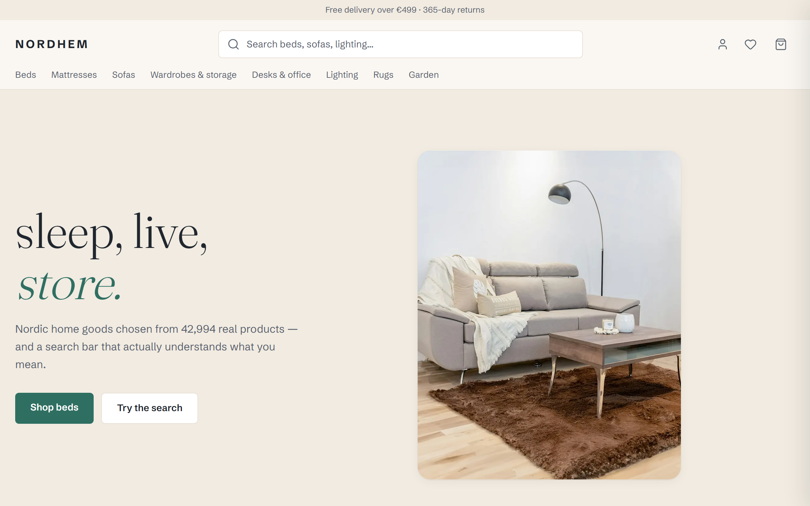
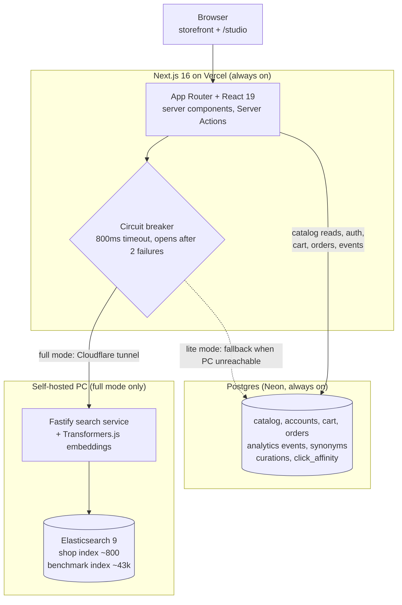

<div align="center">

# NORDHEM

**sleep, live, store.** — a Nordic home-goods storefront with a search-engineering brain.

[](https://nordhem-web.vercel.app)
[](https://antoniojerkovic.com/projects/nordhem)




</div>

A full storefront (browse, cart, checkout, accounts, favorites) sitting on top of a production-shaped Elasticsearch search service, plus a **Search Studio** that exposes the relevance-engineering work that actually matters: offline evaluation against human judgments, ranking tuning, semantic and hybrid retrieval, editor tooling, analytics, and graceful degradation when the engine is offline. It is built to show search relevance engineering and modern React in the same codebase.

The live site runs in **full mode** when the self-hosted search engine is up (Docker running Elasticsearch + a Fastify service over a tunnel). When it is not, the site automatically falls back to a Postgres **lite mode**, so it is never down.

## The two surfaces

- **The storefront** is the public shop: home, product listing pages, product detail pages, search with autocomplete and facets, cart, checkout, order history, and favorites.
- **The Search Studio** (`/studio`) is the relevance-engineering console: relevance lab, editor tools, analytics, and settings. Open in local dev, locked in production to an editor allowlist (`ADMIN_EMAILS`).

## Architecture



The browser talks only to Next.js on Vercel. Catalog browsing, accounts, cart, orders, and analytics events always read and write Postgres directly, so the shop works around the clock. Search is the one path that prefers the self-hosted engine: a circuit breaker tries the Fastify service (~800ms budget) and, if it is unreachable or slow, falls back to Postgres full-text search behind an honest banner.

## What it demonstrates (the search story)

**Query understanding**
- Custom analyzer chain (possessive, lowercase, stopwords, English stemmer) with `dynamic: strict` mappings.
- BM25 multi-field scoring (`best_fields`, name^3, product_class^2) with `fuzziness: AUTO` for typo tolerance.
- Query-time synonyms via a `synonym_graph` filter after the stemmer, so rule edits never reindex the corpus.
- Did-you-mean from a phrase suggester over unstemmed name shingles, returned inline on every search.
- Autocomplete via `search_as_you_type` + `bool_prefix`, proxied same-origin with an 800ms cap that degrades silently.

**Facets and filters**
- Live Elasticsearch aggregation counts (terms and range).
- Deliberate query vs filter vs `post_filter` separation: the typed query scores, cross-cutting filters narrow and cache, multi-select facets keep their own counts.

**The relevance lab (offline evaluation)**
- nDCG@10, MRR, and recall@100 over 480 WANDS queries and 233k human relevance judgments.
- Configurable ranking with instant re-eval, an `_explain` score-breakdown visualizer, and a train/test split so tuning does not overfit.

**Semantic and hybrid search**
- Local `multilingual-e5-small` embeddings (Transformers.js, in-process, no embedding API in the hot path).
- `dense_vector` kNN retrieval fused with BM25 via Reciprocal Rank Fusion as a pure, tested function.
- Measured: hybrid nDCG@10 0.7284 vs lexical 0.6615.

**Editor tools**
- Postgres-stored synonyms hot-reloaded into the live analyzer with no 43k reindex.
- Per-query curations (pin and hide) applied at search time, plus an append-only change-history audit.
- Benchmark-before-apply: a candidate's nDCG impact is scored against the judged set before it goes live.

**Analytics and resilience**
- First-party search events (search, click-with-position, zero-result) written via `sendBeacon`, so telemetry keeps recording even in lite mode.
- A `/studio/analytics` dashboard (top queries, zero-result rate, CTR by position, latency percentiles).
- Circuit breaker + Postgres lite mode + a `/status` page that reports full vs lite honestly.

**AI (never in the hot path)**
- A human-in-the-loop synonym suggestion queue: AI proposes, an editor approves, only then does a rule enter the pipeline.
- A provider-agnostic shopping chatbot that uses tool-use over the `/search` API. It searches and summarises, it never ranks.

## Tech stack

- **Frontend**: Next.js 16 (App Router) + React 19 + Tailwind, on Vercel.
- **Search service**: Fastify + TypeScript + Elasticsearch 9.
- **Database**: Postgres via Drizzle (Neon in production, Docker Postgres in dev).
- **Auth**: Better Auth (email + password, optional Google).
- **Embeddings**: Transformers.js (`multilingual-e5-small`) in-process in the search service.
- **Tooling**: pnpm monorepo, TypeScript strict throughout.

## Dataset

The catalog is the WANDS dataset (Wayfair): 42,994 furniture products, 480 queries, and roughly 233k human relevance judgments. Two indexes are built from it: a curated shop index of about 800 products (with photos and credits) that powers the storefront, and the full 43k benchmark index (text only) that powers the relevance lab. Prices are synthetic. Storefront photos are interior shots from Unsplash and Pexels, credited per product.

## Run it locally

Prerequisites: Node 22+, pnpm, and Docker.

```bash
# 1. Install workspace dependencies
pnpm install

# 2. Start Elasticsearch, Kibana, and Postgres
docker compose up -d

# 3. Download the WANDS dataset into data/wands (gitignored)
pnpm -F @nordhem/tools download-wands

# 4. Load the catalog, build the benchmark + shop indexes, load queries + judgments
pnpm -F @nordhem/search load-wands
pnpm -F @nordhem/search index-products
pnpm -F @nordhem/tools curate-shop
pnpm -F @nordhem/tools import-images
pnpm -F @nordhem/search index-shop
pnpm -F @nordhem/search load-eval
pnpm -F @nordhem/search seed-synonyms

# 5. Run the search service and the web app (two terminals)
pnpm -F @nordhem/search dev   # Fastify on http://localhost:3001
pnpm -F @nordhem/web dev      # Next.js on http://localhost:3000
```

Open http://localhost:3000 for the storefront and http://localhost:3000/studio for the Search Studio. No `.env` is required for a default local setup; the defaults match the Docker services. The catalog browses straight from Postgres, so even with the search service stopped the shop still works in lite mode.

## Repo layout

```
apps/web          Next.js storefront + /studio (the only deployed surface)
services/search   Fastify search service: ES queries, eval harness, embeddings
packages/shared   Shared zod contracts and types (the search API contract)
packages/db       Drizzle schema + client, reused by web, search, and tools
tools             Node scripts: WANDS download, shop curation, image pipeline
docs              PLAN, DECISIONS, DEPLOY, and the rest of the project record
```

## License

[MIT](LICENSE) © Antonio Jerković
