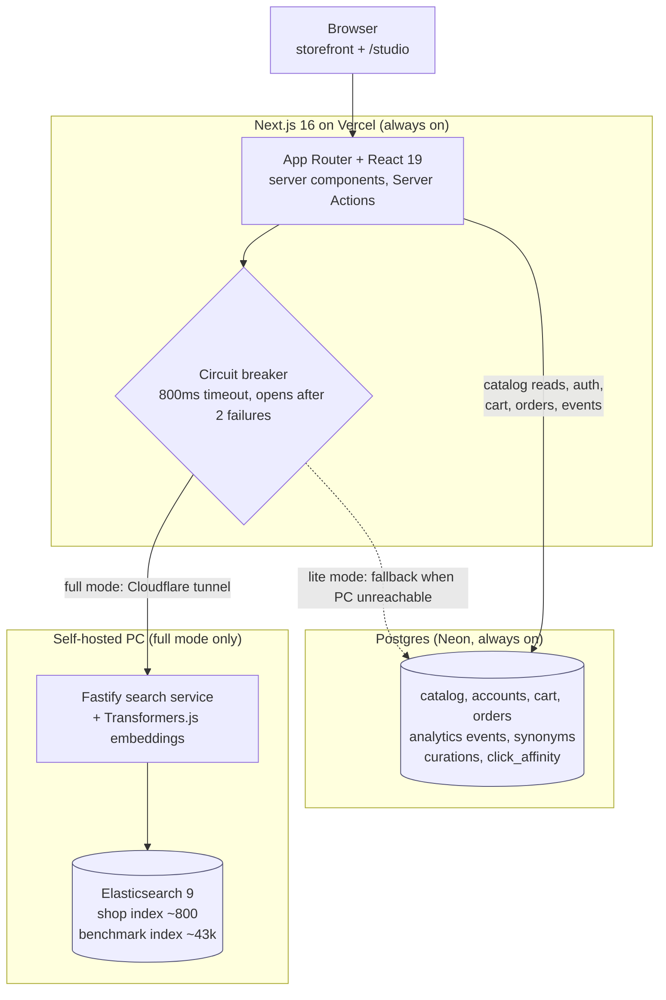

# NORDHEM: sleep, live, store

NORDHEM is a real, modern e-commerce storefront for Nordic home goods with a search-engineering brain. It is the showcase project for a JYSK "Software Engineer, Search" application: a full storefront (browse, cart, checkout, accounts, favorites) sitting on top of a production-shaped Elasticsearch search service, plus a Search Studio that exposes the relevance-engineering work that actually matters in the role: offline evaluation against human judgments, ranking tuning, semantic and hybrid retrieval, editor tooling, analytics, and graceful degradation when the engine is offline. It is built to demonstrate search relevance engineering and modern React in the same codebase.

- **Live demo:** https://nordhem-web.vercel.app — runs in **full mode** when the search service is up on the maintainer's machine (Docker running Elasticsearch + the Fastify service, exposed over a tunnel; see [Run it locally](#run-it-locally) and [docs/DEPLOY.md](docs/DEPLOY.md)). When it is not, the site automatically falls back to a Postgres **lite mode**, so it is never down.
- **Repo:** https://github.com/Kizza00232Jera/nordhem

## Architecture



The browser talks only to Next.js on Vercel. Catalog browsing, accounts, cart, orders, and analytics events always read and write Postgres directly, so the shop works around the clock. Search is the one path that prefers the self-hosted engine: a circuit breaker tries the Fastify service (reached over a Cloudflare tunnel, ~800ms budget) and, if it is unreachable or slow, falls back to Postgres full-text search ("lite mode") behind an honest banner. Full mode means the PC is up; lite mode means it is asleep.

## The two surfaces

- **The NORDHEM storefront** is the public shop: home, product listing pages, product detail pages, search with autocomplete and facets, cart, checkout, order history, and favorites.
- **The Search Studio** lives under `/studio` and is the relevance-engineering console: relevance lab, editor tools, analytics, and settings. It is open in local development and locked in production to an editor email allowlist (`ADMIN_EMAILS`).

## What it demonstrates (the search story)

**Query understanding**
- Custom analyzer chain (possessive, lowercase, stopwords, English stemmer) with `dynamic: strict` mappings.
- BM25 multi-field scoring (`best_fields`, name^3, product_class^2) with `fuzziness: AUTO` for typo tolerance.
- Query-time synonyms via a `synonym_graph` filter placed after the stemmer, so rule edits never reindex the corpus.
- Did-you-mean from a phrase suggester over unstemmed name shingles, returned inline on every search.
- Autocomplete via `search_as_you_type` + `bool_prefix`, proxied same-origin with an 800ms cap that degrades silently.

**Facets and filters**
- Live Elasticsearch aggregation counts (terms and range) modelled on JYSK's category-scoped filters.
- Deliberate query vs filter vs `post_filter` separation: the typed query scores, cross-cutting filters narrow and cache, multi-select facets keep their own counts.

**The relevance lab (offline evaluation)**
- nDCG@10, MRR, and recall@100 computed over 480 WANDS queries and 233k human relevance judgments.
- Configurable ranking with instant re-eval, `_explain` score-breakdown visualizer, and a train/test query split so tuning does not overfit the judgments.

**Semantic and hybrid search**
- Local `multilingual-e5-small` embeddings (Transformers.js, in-process, no embedding API in the hot path).
- `dense_vector` kNN retrieval fused with BM25 via Reciprocal Rank Fusion implemented as a pure, tested Node function.
- Measured: hybrid nDCG@10 0.7284 vs lexical 0.6615; semantic alone raises ranking but trades away recall.

**Editor tools (the job-post requirement)**
- Postgres-stored synonyms hot-reloaded into the live Elasticsearch analyzer with no 43k reindex.
- Per-query curations (pin and hide) applied at search time, plus an append-only change-history audit.
- Benchmark-before-apply: a candidate's nDCG impact is scored against the judged set before it goes live.

**Analytics and resilience**
- First-party search events (search, click-with-position, zero-result) written to Postgres via `sendBeacon`, so telemetry keeps recording even in lite mode.
- A `/studio/analytics` dashboard (top queries, zero-result rate, CTR by position, latency percentiles, live vs synthetic).
- The circuit breaker plus Postgres full-text lite mode plus a `/status` page that reports full vs lite honestly.

**The learning loop**
- Click affinity computed with position-bias (inverse-propensity) correction, normalised and capped into a query-time `function_score` boost.
- Measured: nDCG@10 0.6560 to 0.6762, flagged honestly as an optimistic upper bound because the clicks here are synthesised from the same judgments the eval scores against.

**AI (never in the hot path)**
- A human-in-the-loop synonym suggestion queue: AI proposes, an editor approves, only then does a rule enter the existing synonym pipeline.
- A provider-agnostic shopping chatbot that uses tool-use over the `/search` API: the model searches and summarises, it never ranks and never sits in the search hot path.

## Tech stack

- **Frontend**: Next.js 16 (App Router) + React 19 + Tailwind, deployed on Vercel.
- **Search service**: Fastify + TypeScript + Elasticsearch 9.
- **Database**: Postgres via Drizzle (Neon in production, Docker Postgres in dev).
- **Auth**: Better Auth (email + password, optional Google), users in our own Postgres.
- **Embeddings**: Transformers.js (`multilingual-e5-small`) running in-process in the search service.
- **Tooling**: pnpm monorepo, TypeScript strict throughout.

## Dataset

The catalog is the WANDS dataset (Wayfair): 42,994 furniture products, 480 queries, and roughly 233k human relevance judgments. Two indexes are built from it: a curated shop index of about 800 products (with photos and credits) that powers the storefront, and the full 43k benchmark index (text only) that powers the relevance lab. Prices are synthetic (deterministically generated, not real Wayfair prices). Storefront photos are interior shots from Unsplash and Pexels, hotlinked and credited per product.

## Run it locally

Prerequisites: Node 22+, pnpm, and Docker.

```bash
# 1. Install workspace dependencies
pnpm install

# 2. Start Elasticsearch, Kibana, and Postgres
docker compose up -d

# 3. Download the WANDS dataset into data/wands (gitignored)
pnpm -F @nordhem/tools download-wands

# 4. Load the catalog into Postgres, build the benchmark + shop indexes,
#    and load the queries + judgments for the relevance lab
pnpm -F @nordhem/search load-wands
pnpm -F @nordhem/search index-products
pnpm -F @nordhem/tools curate-shop
pnpm -F @nordhem/tools import-images   # restore the judged storefront photos
pnpm -F @nordhem/search index-shop
pnpm -F @nordhem/search load-eval
pnpm -F @nordhem/search seed-synonyms

# 5. Run the search service and the web app (two terminals)
pnpm -F @nordhem/search dev   # Fastify on http://localhost:3001
pnpm -F @nordhem/web dev      # Next.js on http://localhost:3000
```

Open http://localhost:3000 for the storefront and http://localhost:3000/studio for the Search Studio. Kibana is at http://localhost:5601 for poking at the indexes. No `.env` is required for a default local setup; the defaults match the Docker services. Studio access is open in local development.

The catalog browses straight from Postgres, so even with the search service stopped the shop still works in lite mode. Semantic and hybrid search additionally need the embedding vectors built into the index (the first 43k embedding batch takes roughly 40 minutes).

## Live demo and modes

The deployed site runs in one of two modes:

- **Full mode**: the self-hosted PC and its tunnel are up, so search runs on Elasticsearch with facets, synonyms, semantic and hybrid ranking, and the chatbot.
- **Lite mode**: the PC is asleep, so the circuit breaker serves Postgres full-text search instead. The shop, accounts, cart, and checkout all keep working; an honest banner explains that advanced search is degraded, and `/status` reports the current mode.

**Bring your own engine**: because the PC is not always on, a visitor can drive the live site from their own machine for the length of their session. Clone the repo, run the search service locally, expose it with `pnpm -F @nordhem/search tunnel` (a quick Cloudflare tunnel to localhost:3001), then paste the tunnel URL and the shared password on `/status`. That stores a per-session engine override (an https-only cookie), so your choice never affects any other visitor. See `docs/DEPLOY.md` for the full walkthrough.

## Repo layout

```
apps/web          Next.js storefront + /studio (the only deployed surface)
services/search   Fastify search service: ES queries, eval harness, embeddings
packages/shared   Shared zod contracts and types (the search API contract)
packages/db       Drizzle schema + client, reused by web, search, and tools
tools             Node scripts: WANDS download, shop curation, image pipeline
docs              PLAN, DECISIONS, DEPLOY, and the rest of the project record
teaching          Per-step HTML course (gitignored, personal study material)
```

## A learning project, too

NORDHEM is also a structured learning and interview-prep vehicle. Every build step ends with a teaching artifact (an HTML lesson with annotated real code, exercises, a quiz, and interviewer Q&A) under `teaching/`, alongside an interview question bank. Those are gitignored personal materials; the roadmap and the reasoning behind every decision live in `docs/PLAN.md` and `docs/DECISIONS.md`.
